# KrishiDisha 🌾

**AI decision support for Indian farmers.** Crop and fertilizer recommendations, leaf-photo
disease detection trained on our own field photographs, yield prediction, weather advisories,
live mandi prices, government scheme lookup, a farm-input marketplace and a multilingual
agricultural assistant — one Flask app, running on a laptop or a single dyno.


[](LICENSE)

[](https://doi.org/10.1109/ICoEIT63558.2025.11211713)

Built by Abhishek Chourasia, Goutam Mandloi and Shivpratap Singh Panwar.

This repository is the reference implementation of our paper **"KrishiDisha: Revolutionizing
Agriculture with Intelligent Recommendations, Disease Detection, and Yield Prediction"**,
2025 IEEE International Conference on Engineering Innovations and Technologies (ICoEIT),
pp. 1028-1040, [doi:10.1109/ICoEIT63558.2025.11211713](https://doi.org/10.1109/ICoEIT63558.2025.11211713).
The paper describes the platform as field-validated with 150+ farmers. The code here has moved
past what the paper reports: the disease model is now trained only on field photographs of Indian
crops, the yield and fertilizer models were rebuilt without target leakage, and the more advanced
parts (our own fine-tuned agronomy LLM, regional-language support, a farmer feedback and labelling
loop) are in active development - see [Roadmap](#roadmap).

## Screenshots

| | |
|---|---|
| 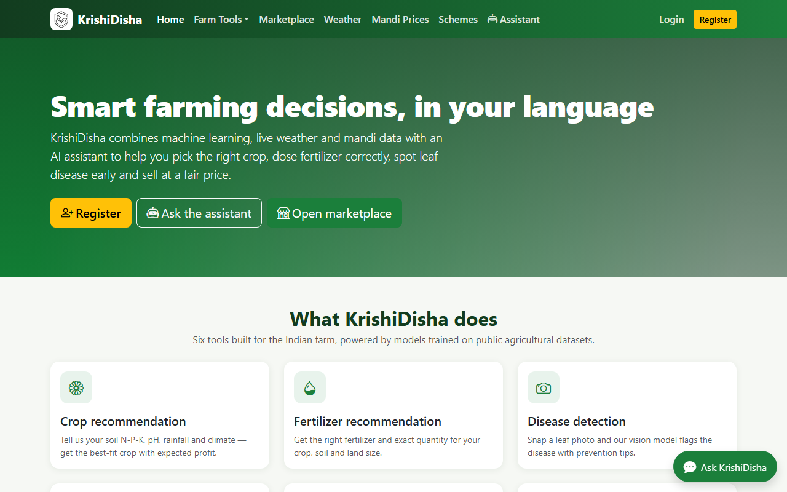 <br> Landing page — six tools, one assistant | 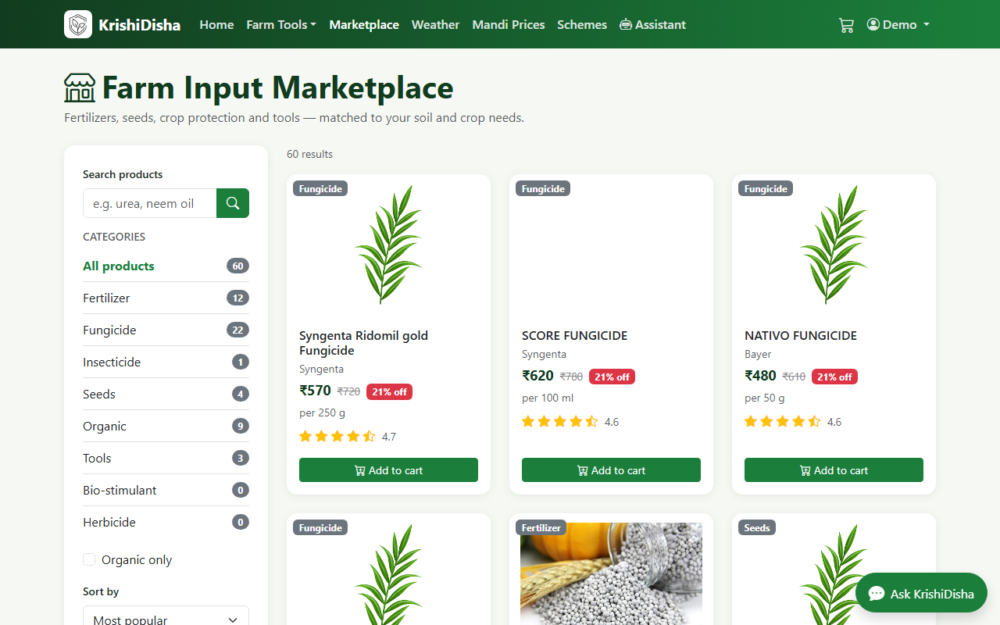 <br> Marketplace — 60 seeded fertilizer/crop-protection/seed products |
| 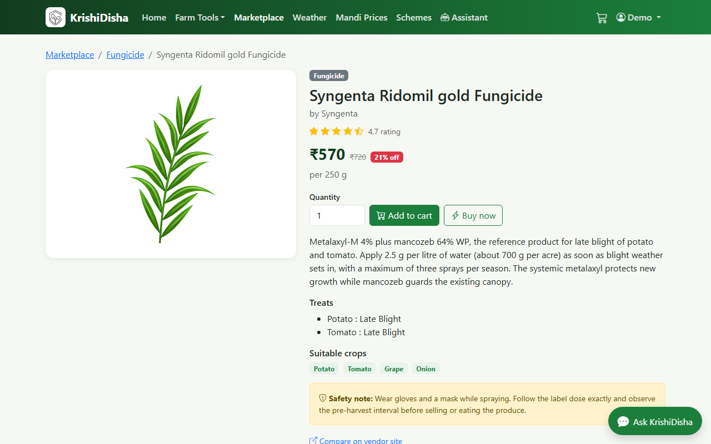 <br> Product detail with rating and add-to-cart | 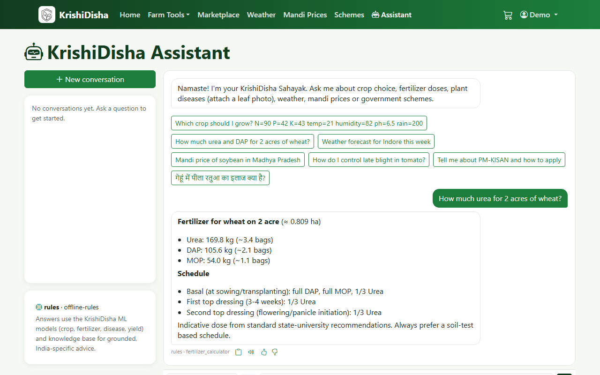 <br> Assistant answering a fertilizer-dose question with the calculator tool |
| 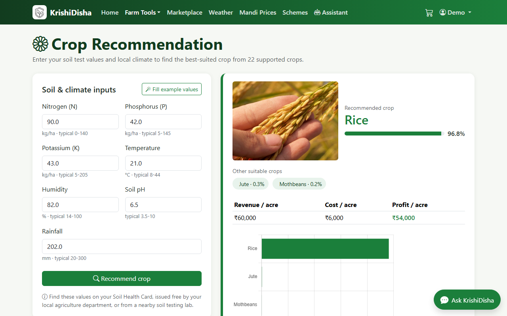 <br> Crop recommendation from soil N-P-K, pH, climate | 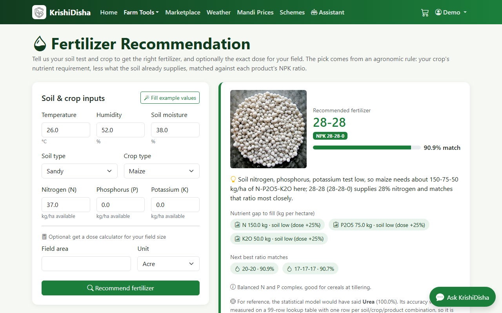 <br> Fertilizer pick from soil-test nutrient deficit |
| 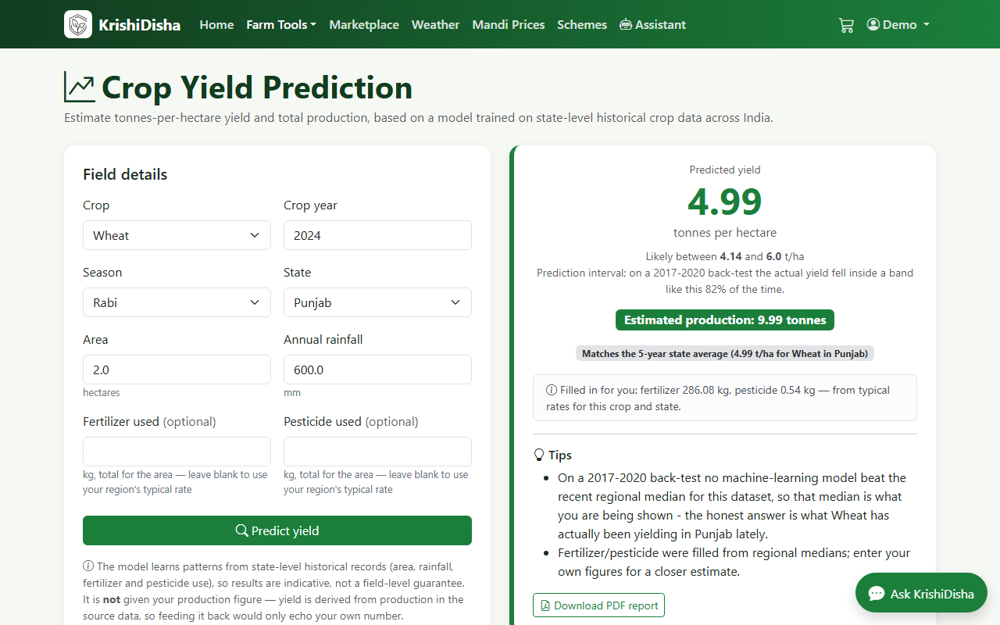 <br> Yield prediction with a calibrated 80%-band | 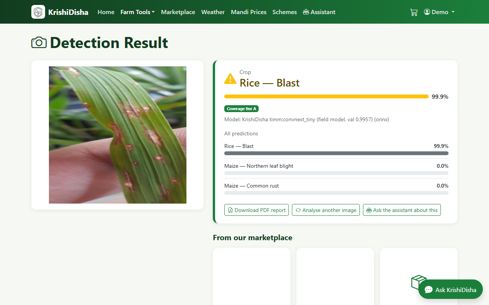 <br> Disease detection on a real rice-blast field photo |
| 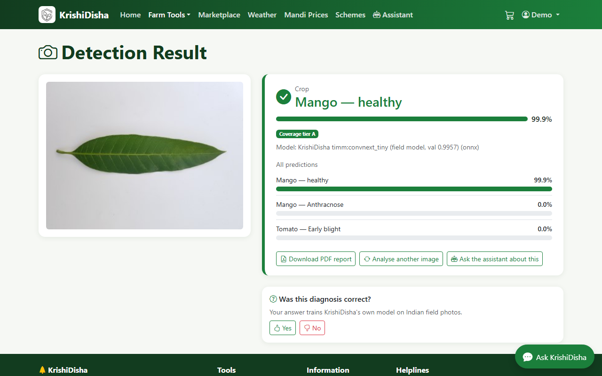 <br> Correctly clearing a healthy mango leaf | 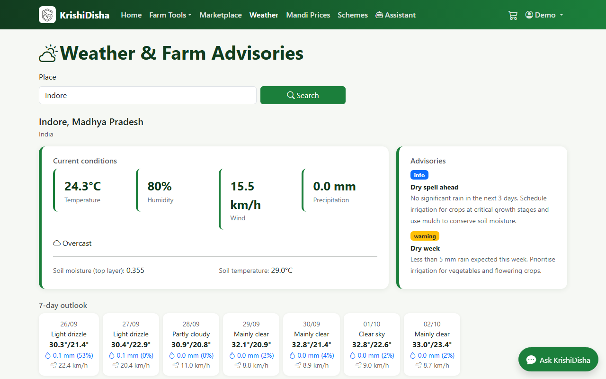 <br> 7-day forecast and rule-based agro-advisories |
| 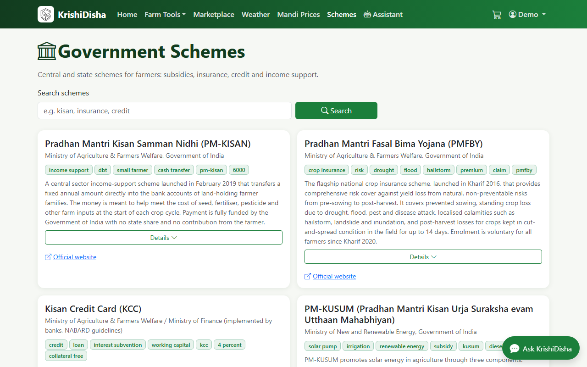 <br> Central scheme lookup with eligibility and links | 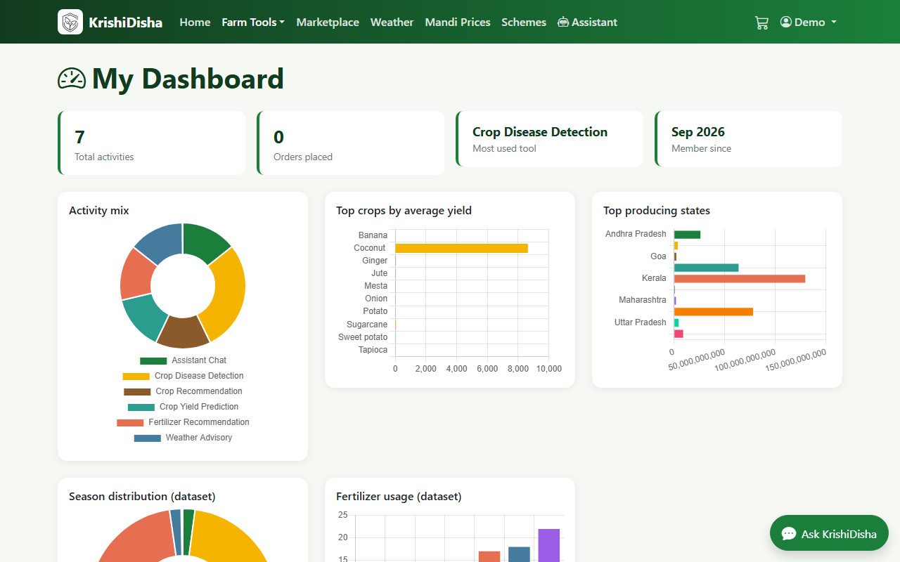 <br> A farmer's own activity and regional yield/fertilizer charts |
| 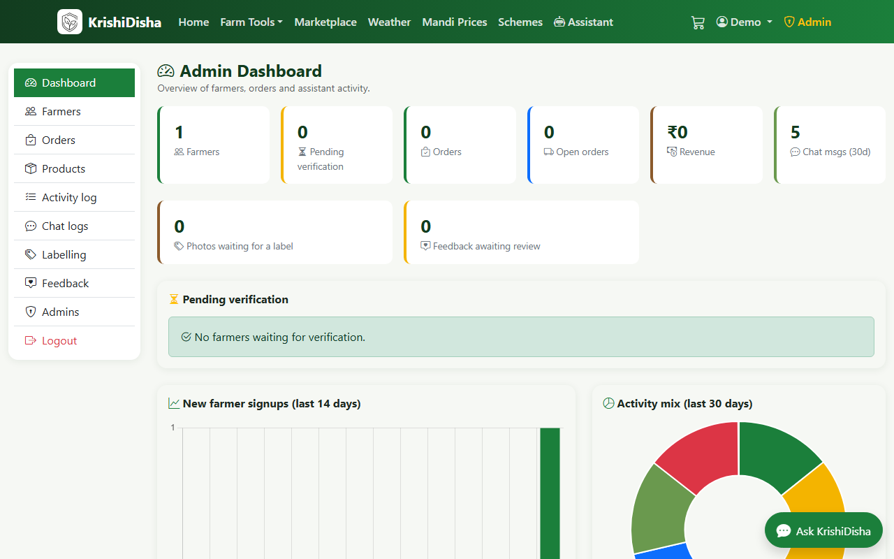 <br> Admin console: farmers, orders, activity, chat logs | 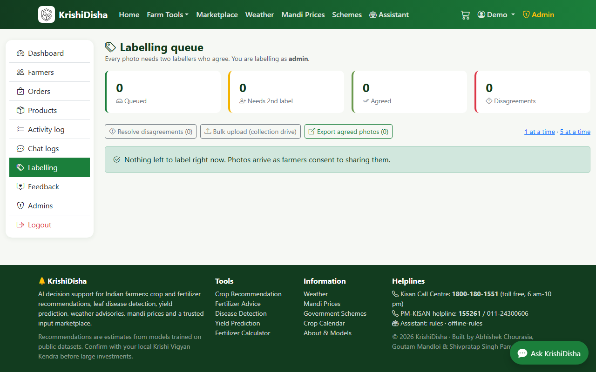 <br> Double-blind labelling queue that feeds the next disease-model retrain |

## What's inside

| Area | What it does | Where |
|---|---|---|
| Crop recommendation | 22 crops from N, P, K, temperature, humidity, pH, rainfall; top-3 with probabilities, indicative economics, cultivation guide, PDF report | `/crop_recommendation` |
| Fertilizer recommendation | Urea / DAP / complex grades from soil and crop type, plus a kg-and-bags dose calculator with split schedule, PDF report, matching products | `/fertilizer_recommendation`, `/tools/fertilizer-calculator` |
| Disease detection | Upload a leaf photo, get crop + condition, confidence, coverage tier, prevention steps, matching marketplace products, PDF report | `/crop_detection` |
| Yield prediction | Tonnes/ha for 54 crops x 30 states x 6 seasons, with a calibrated prediction interval | `/crop_yield` |
| Weather | 7-day forecast, soil moisture, and rule-based agro-advisories (rain, heat, frost, spraying windows) via Open-Meteo | `/weather` |
| Mandi prices | Live Agmarknet prices from data.gov.in with MSP fallback | `/mandi` |
| Schemes & calendar | 16 central schemes with eligibility and how to apply; sowing/harvest calendar; 32 crop guides; pest management | `/schemes`, `/crop-calendar`, `/crop-guide/<crop>` |
| Marketplace | 60 seeded products (fertilizers, fungicides, insecticides, seeds, organics, tools), cart, checkout (COD/UPI), order tracking, stock control | `/marketplace` |
| Assistant | Chat with tool use over every service above, leaf photo analysis, Hindi/Hinglish/regional languages, conversation history | `/chat` and the floating widget |
| Admin | Farmer verification and CRUD, orders, catalogue, activity audit, chat logs, double-blind disease-photo labelling queue | `/admin_dashboard` |
| JSON API | Everything above for apps/SMS/WhatsApp gateways | `/api/v1/...` (see `/about`) |

## Results

Numbers below are quoted from `models/reports/*.md` and `models/metrics_tabular.json` — nothing
here is invented.

### Disease detection — KrishiDisha's own field model

The served model is trained only on **field photographs** of crops Indian farmers grow (rice,
sugarcane, mango, cotton, wheat, plus PlantDoc field images for tomato, potato, maize and others,
and a "not a leaf" class). PlantVillage lab photos are excluded from training and from every
number below.

Model v2 (ConvNeXt-Tiny trained on Kaggle, 21,710 images / 60 classes / 9 sources, including the
10,407 Paddy Doctor phone photos from Tamil Nadu paddy fields covering 10 rice conditions):
**94.3% top-1, 98.8% top-3 on 2,828 held-out field photos**. Non-leaf photos are rejected 99.6% of
the time and 93% of real leaves pass the plant check. Macro-F1 84.8%, expected calibration error 0.021.

| Tier | Crops | Top-1 |
|---|---|---|
| A (>=1,000 field training images, >=90% top-1) | Rice (10 conditions), Mango, Sugarcane | 94-100% |
| B (>=300 images, >=80% top-1) | Cotton, Wheat | 99-100% |
| C (experimental — shown with a warning in the app) | PlantDoc crops (apple, tomato, potato, maize, ...) | 40-100%, 70% overall |

| Version | Images / classes | Field test | Top-1 | Top-3 |
|---|---|---|---|---|
| v1 (2026-09-26) | 13,858 / 54 | 1,650 photos | 95.6% | 99.3% |
| v2 (2026-09-27) | 21,710 / 60 | 2,828 photos (harder: adds Paddy Doctor) | 94.3% | 98.8% |

On the sources shared by both versions v2 matches v1 (cotton 99.3%, mango 100%, sugarcane 98.8%,
wheat 100%); the headline moved because the test set grew, not because the model regressed.
Paddy Doctor alone scores 92.7% top-1 / 98.4% top-3 on its 1,178 test photos.

### Tabular models

| Task | Headline | Note |
|---|---|---|
| Yield | Baseline MAE **1.10 t/ha** / MAPE 27% / R² 0.66 on a time split (fit <=2016, test 2017-2020) | No trained model beat the 5-year Crop x State median (tuned XGBoost: 1.31 t/ha), so the median baseline ships. Prediction interval claims 80% coverage, measures 82.1% |
| Crop recommendation | 99.3% hold-out accuracy (tuned + calibrated RandomForest) | The 22 classes are near-separable in this Kaggle dataset — a sanity check, not a field-accuracy claim |
| Fertilizer | Rule-first, not model-first | `recommend_fertilizer()` ranks the catalogue against the crop's soil-test-adjusted nutrient deficit; the classifier is only a labelled `model_hint`. Its 99-row training set is one row per soil/crop/product combination — memorisation, not skill |

Full model cards: `models/reports/crop_card.md`, `fertilizer_card.md`, `yield_card.md`,
`disease_eval.md`.

## Model weights

The trained weights (disease classifier ONNX/PyTorch, tabular models, the fine-tuned assistant GGUF) are **not
distributed** with this repository or on Kaggle; the training data, code, metrics, reports and model cards are.
The code runs without them (rule-based and fallback paths), and the private lab pipeline
reproduces them from the public datasets listed in `ml/datasets/sources.yaml`. To obtain the weights themselves
(research, pilot or partnership), email Shivpratap Singh Panwar at shivpratapsinghpanwar19@gmail.com.

## Architecture

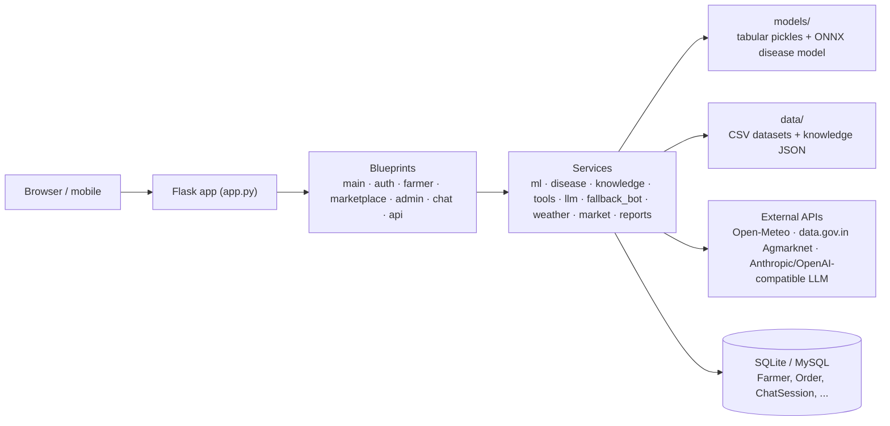

## Quick start

With [uv](https://docs.astral.sh/uv/) (recommended, one command creates the environment from `pyproject.toml` + `uv.lock`):

```bash
uv sync --extra api               # creates .venv with CPU-only PyTorch; drop --extra api if you don't need FastAPI
copy .env.example .env            # optional: add API keys, switch DB, etc.
uv run app.py                     # http://localhost:5000
uv run pytest                     # tests
```

With plain pip:

```bash
python -m venv .venv
.venv\Scripts\activate            # Windows   (source .venv/bin/activate on Linux/macOS)
pip install -r requirements.txt
python app.py
```

* Default admin: `admin` / `admin123` (change with `DEFAULT_ADMIN_*` in `.env` or `flask --app app create-admin NAME PASS`).
* The database is SQLite in `instance/` by default; set `DATABASE_URL` for MySQL.
* The tabular models ship in `models/`; if missing they are trained on first use (seconds). The lab pipeline retrains them.
* Farmers must be verified by an admin before login (as in the project report). Set `AUTO_VERIFY_FARMERS=true` for demos.
* Warm everything up once (models, disease network, assistant): `flask --app app warmup`.

## The assistant

`LLM_PROVIDER` selects the brain; all providers share the same tools (`krishidisha/services/tools.py`) and the same TF-IDF retrieval over the knowledge base, so answers are grounded in the project's own data and models.

| Provider | Setup | Notes |
|---|---|---|
| `anthropic` | `ANTHROPIC_API_KEY` | Claude with native tool use and vision (default when a key is present) |
| `openai` | `OPENAI_API_KEY` or `OPENAI_BASE_URL` | Any OpenAI-compatible endpoint: OpenAI, Groq, OpenRouter, local Ollama / LM Studio, or Gemini's free tier |
| `rules` | nothing | Offline intent engine that still runs the ML models, weather, prices, calculator, schemes and KB search. Automatic fallback if an API call fails. |

## Project layout

```
app.py                      WSGI entry point (gunicorn app:app)
krishidisha/                Flask package
  __init__.py               app factory, services, CLI (seed, create-admin, warmup)
  config.py                 environment-driven configuration (.env)
  models.py                 Farmer, Admin, FarmerActivity, Product, CartItem, Address, Order, ChatSession ...
  blueprints/               main, auth, farmer, marketplace, admin, chat, api
  services/                 ml, disease, knowledge, tools, llm, fallback_bot, weather, market, reports
ml/                         runtime model code: estimators, registry, taxonomy, model factory, tool format
data/                       CSV datasets + knowledge/*.json (schemes, products, crop guides, calendar, pests, MSP)
models/                     trained artefacts, metrics_tabular.json, evaluation plots and reports in models/reports
templates/, static/         Bootstrap 5 UI
tests/                      pytest suite (offline; in-memory SQLite)
api/                        optional standalone FastAPI service (legacy)
docs/screenshots/           UI screenshots used in this README
```

## Training

The models are trained with KrishiDisha's own pipeline (field-photo dataset builder with perceptual-hash dedup, ConvNeXt trainer with calibration and ONNX export, honest tabular protocol with a time split, teacher distillation and QLoRA fine-tuning for the assistant). That pipeline, the Kaggle notebooks and the trained weights are kept in a private lab repository; the public repository ships the app, the runtime model code, every metric, report and model card, and the dataset licence table in `ml/datasets/sources.yaml`. For research or partnership access email Shivpratap Singh Panwar at shivpratapsinghpanwar19@gmail.com.

## Tests

```bash
pytest
```

The suite runs fully offline (rules assistant, stub disease model, in-memory database).

## Deployment

`Procfile` runs `gunicorn app:app`. Set `SECRET_KEY`, `DATABASE_URL`, `AUTO_VERIFY_FARMERS` and any API keys as environment variables. Uploads go to `static/uploads/` (`UPLOAD_DIR`).

## Roadmap

- **Own LLM fine-tune** — replace the general-purpose assistant backend with a QLoRA fine-tune of an open model on KrishiDisha's own agronomy Q&A data, so the assistant stops depending on a third-party API key.
- **Regional languages** — a translation layer over the assistant and reports for Hindi, Marathi, Punjabi, Gujarati, Tamil, Telugu, Kannada and Bengali beyond the current Hinglish/English handling.
- **Photo-collection drive** — grow the field-photo dataset behind the disease model directly from consenting farmers (see the admin labelling queue), to raise the tier-C crops (apple, tomato, potato, maize, ...) into tier A/B.
- **PlantVillage stays excluded** — by design, lab-condition photos are not used to train or evaluate the served disease model; only real field photographs count.

## License

Source-available under the **PolyForm Noncommercial License 1.0.0** — see [LICENSE](LICENSE).
Noncommercial use (personal, academic, research, charitable, public-sector) is permitted;
commercial use requires a separate written agreement with the copyright holders. Datasets and
third-party libraries keep their own licences (see `ml/datasets/sources.yaml` and
`models/reports/*_card.md`).

## Team

Shivpratap Singh Panwar, Abhishek Chourasia and Goutam Mandloi - the founding team behind
KrishiDisha.

## Citation

If you use KrishiDisha in research, please cite the paper:

```bibtex
@inproceedings{krishidisha2025,
  title     = {KrishiDisha: Revolutionizing Agriculture with Intelligent Recommendations, Disease Detection, and Yield Prediction},
  author    = {Panwar, Shivpratap Singh and Chourasia, Abhishek and Mandloi, Goutam},
  booktitle = {2025 IEEE International Conference on Engineering Innovations and Technologies (ICoEIT)},
  pages     = {1028--1040},
  year      = {2025},
  doi       = {10.1109/ICoEIT63558.2025.11211713}
}
```

## Disclaimer

Recommendations are estimates from models trained on public datasets. Validate with your local Krishi Vigyan Kendra or an agronomist before large investments. Kisan Call Centre: 1800-180-1551.
